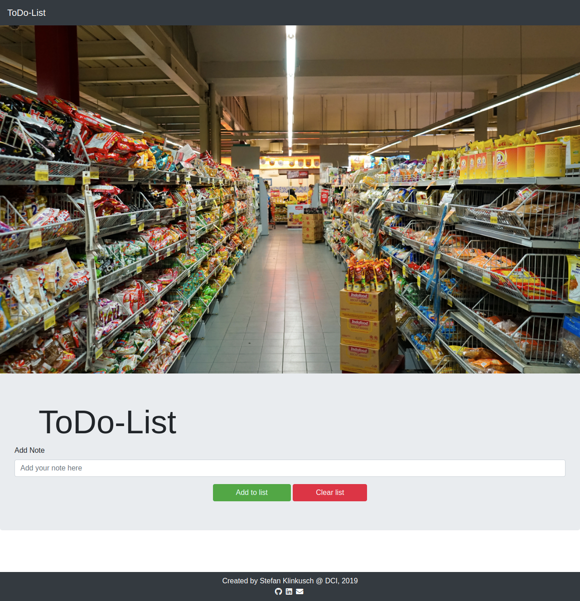

# Architecture with Eventlisteners

This ToDo list was created by Stefan Klinkusch at Digital Career Institute in Berlin, Germany using vanilla JavaScript.

## Features

The page features
- a title image
- an input field to enter new items to the list
- two buttons:
  - one to add the item given by the input field
  - one to clear the whole list
- for each item:
  - a color depending on the status; the status can be changed by clicking on the item
    - blue: in the queue
    - yellow: pending
    - green: done
    - red: to be deleted
  - a button to delete the item
- connection to localStorage using JSON methods
- a footer with additional information and some links

## Screenshot

